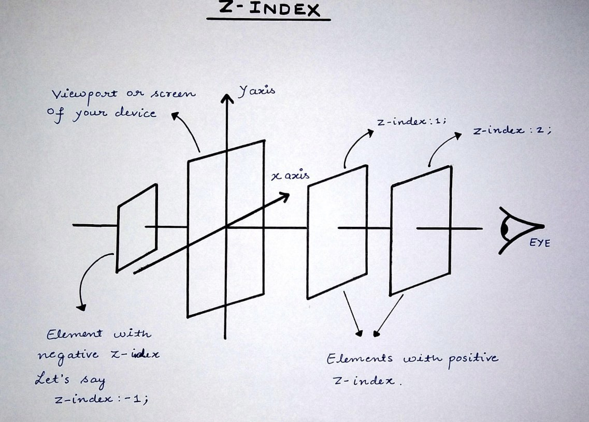
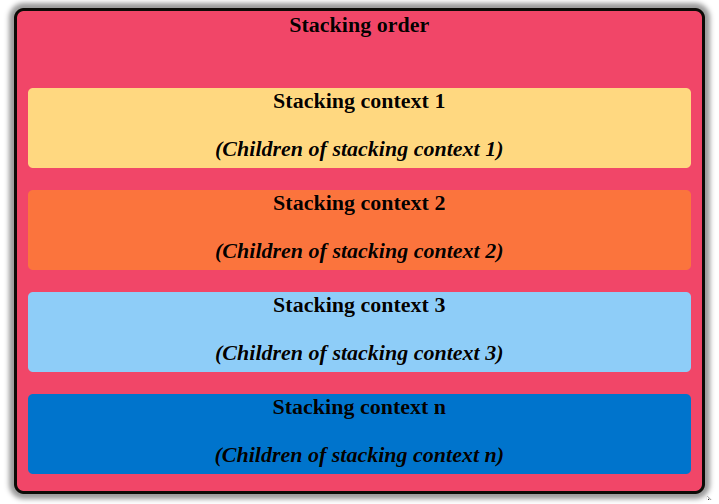
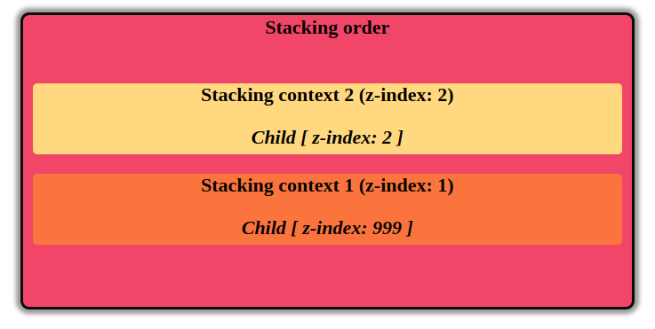

## Haizz chết tiệt ! Cái z-index chết tiệt này, nó đang làm cái quái gì vậy hả ?

Trước tiên, có 1 vài thuật ngữ được sử dụng:

- Element: là 1 tag trong `html`: `div p img, etc...`
- Children: element con
- Parent: element cha

`z-index` là 1 property của css có nhiệm vụ sắp xếp các element theo trục Z. Hãy tưởng tượng 1 đường thẳng từ mắt bạn đến màn hình, đó chính là trục Z.

<p align="center">

</p>

## Cơ bản:

- `z-index` chỉ hoạt động trên các element đã được `position`. Tức là cần phải sử dụng property `position` (relative, absolute, fixed, sticky) nếu muốn điều chỉnh thứ tự xuất hiện khi sử dụng `z-index `

  > Méo có static đâu vì vị trí mặc định của phần tử html là static, nghĩa là cho vào thế nào thì nó là như thế. Nên nếu để position: static (hoặc không để) thì trình duyệt tôn trọng thứ tự mặc định.

  > Ví dụ: https://codepen.io/lexuantien1997/pen/XWZWqbV

- `z-index` có thể nhận vào giá trị âm. Khi dó element sẽ ở _phía sau_ element khác. Ví dụ: https://codepen.io/lexuantien1997/pen/poaoVge

```css
.my-element {
  background: rgb(232 240 254 / 0.4);
}

.my-element .child {
  position: relative;
  z-index: -1;
}
```

- Tương tự nếu `z-index: auto`
- Thêm đoạn css này vào `.my-element`, thì element `.child` sẽ xuất hiện phía trước

```css
.my-element {
  position: relative;
  z-index: 0;
  background: rgb(232 240 254 / 0.4);
}
```

Ví dụ: https://codepen.io/lexuantien1997/pen/QWQWrGG

> Bởi vì `.my-element` có `position` khác static và `z-index` khác auto, nên nó đã tạo ra 1 cái `stacking context`. Nghĩa là nếu set .`child` giá trị `z-index: -999`, thì nó cũng sẽ không xuất hiện phía sau `my-parent`.

## Nâng cao:

**Hiểu sai**: ~~element nào có `z-index` cao thì nằm trên, nhỏ thì nằm dưới~~. Mới học thì hiểu như vậy cũng được, nhưng bản chất thì sai

**Hiểu đúng**: mọi element trong `html` document có thể ở phía trước hay ở phía sau các **element** khác trong document. Cái này được gọi là **`stacking order`**

**Stacking context:**

Là tập hợp 1 nhóm các element có chung parent, di chuyển cùng nhau trong `stacking order`, tạo nên thứ gọi là `stacking context`

Mỗi `stacking context` sẽ có 1 parent element (gọi là root element cũng được) wrap các element con vào 1 vị trí cố định trong `stacking order`.

<p align="center">

</p>

Vì các `stacking context` được sắp xếp theo thứ tự trong `stacking order`, nên không có cách nào để element trong `stacking context 3` xuất hiện phía trước element nằm trong `stacking context 1`. Cho dù có set `z-index` là vô cực thì cũng vậy.

Ví dụ: https://codepen.io/lexuantien1997/pen/RwQwyZb

Ở ví dụ trên:

- Parent element 1 có `z-index: 1`, vì vậy nó đã tạo stacking context_1, và child element có `z-index: 999`
- Parent element 2 có `z-index: 2`, vì vậy nó đã tạo stacking context_2 và child element cũng có `z-index: 2`
- Bởi vì cả 2 parent element đã tạo `stacking context`, nên `z-index` của tất cả children sẽ dựa theo parent.

<p align="center">

</p>

**Khởi tạo stacking context:** Không nhất thiết phải apply `z-index` và `position` để tạo `stacking context`. `Stacking context` có thể gắn với element bằng 1 trong các cách dưới đây:

- Là root của document (`<html>`)
- Element với `position` là absolute | relative và `z-index` khác _auto_
- Element với `position` là fixed | sticky (sticky cho mobile browsers, ngoại trừ old desktop)
- Element là children của `flex | grid` container và `z-index` khác _auto_
- Element có `opacity` < 1
- Element có `mix-blend-mode` khác _normal_
- 1 trong các property `[transform, filter, backdrop-filter, perspective, clip-path, mask / mask-image / mask-border]` khác _none_
- Element có `isolation: isolate`

**Stacking order trong stacking context:** Bản chất các `stacking context` cũng chính là các `stacking order` với các cấp thấp hơn . Dưới đây là các rule để xác định stacking order trong stacking context ( Theo thứ tự từ thấp đến cao)

1. Parent của stacking context.
2. Các element đã được `position` và `z-index` < 0 (Giá trị cao ở trước, thấp ở sau, element bằng nhau thì kiểm tra thứ tự xuất hiện trong `html`).
3. Các element không được `position` (element bằng nhau thì kiểm tra thứ tự xuất hiện trong `html`).
4. Các element được `position` và `z-index: auto` (element bằng nhau thì kiểm tra thứ tự xuất hiện trong `html`).
5. Các element đã được `position` và `z-index` > 0 (Giá trị cao ở trước, thấp ở sau, element bằng nhau thì kiểm tra thứ tự xuất hiện trong `html`).
