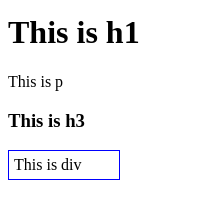
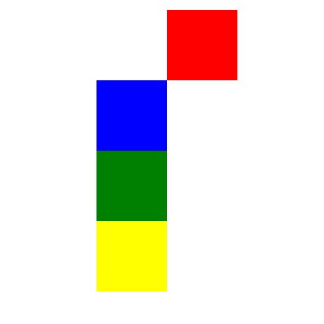
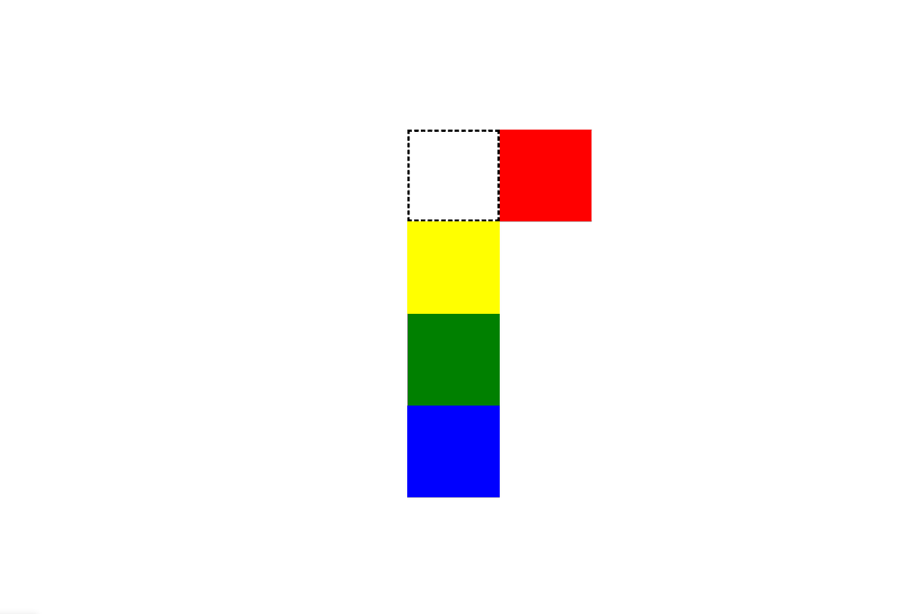
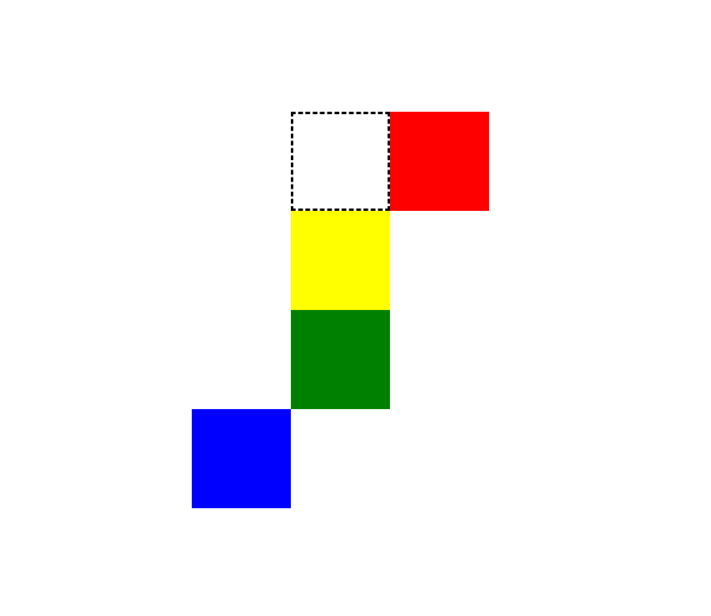
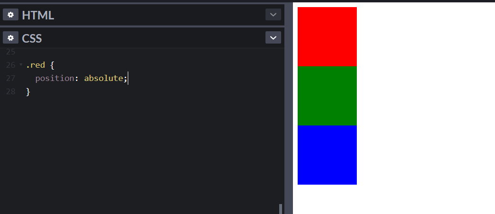
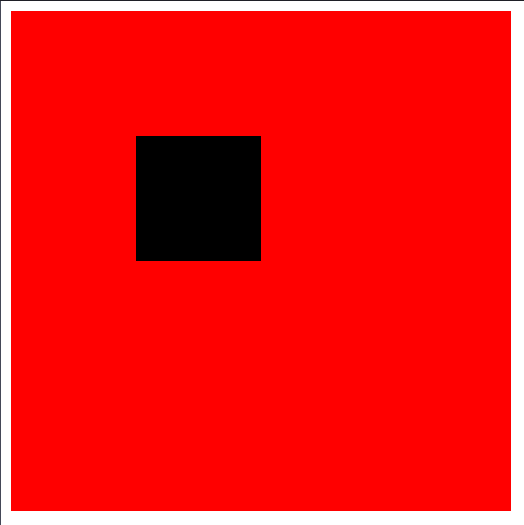

Có 7 giá trị bạn có thể truyền vào thuộc tính position

- static
- relative
- absolute
- fixed
- sticky
- initial
- inherit

Trước hết bạn phải biết document flow là gì ?

- Các element được hiển thị trên screen giống như những gì chúng được viết trong HTML document
- Hãy xem đoạn code phía dưới:
  > `h1, p, h3` và `div` được hiển thị chính xác trên screen giống như những gì chúng được viết trong HTML

```html
<h1>This is h1</h1>
<p>This is p</p>
<h3>This is h3</h3>
<div class="box">This is div</div>
```

<p >

</p>

📌 Static

- Giá trị mặc định của HTML là static
- Dù có khai báo hay không thì các element sẽ được hiển thị trên screen giống như những gì chúng được viết trong HTML document

📌 Relative

- Thay đổi vị trí mà không làm ảnh hưởng tới các element khác trong document flow
- Thay đổi khỏi vị trí ban đầu bằng cách sử dụng offset (top, right, bottom, left)
- Ví dụ: hãy xem đoạn code và output ở phía dưới

> Có thể thấy red box đã được thay đổi (shifted) 100px sang phải bởi vì đã được apply left offset

```CSS
.red {
  position: relative;
  /*  */
  left: 100px;
}
```

  <p>
  
  </p>

> Trong ảnh phía dưới, vùng tô viền chính là vị trí ban đầu nếu không apply position relative và offset

<p >

</p>

> Bây giờ nếu shift hộp blue sang trái 100px. Rất đơn giản:

```CSS
.blue {
  position: relative;
  right: 100px;
}
```

Lưu ý: relative position không ảnh hưởng đến document flow

<p  >

</p>

📌 Absolute

- Element sẽ bị remove khỏi document flow
- Khi apply absolute position, element sẽ không còn ở trong luồng (flow) và không có khoảng trống (space) nào được tạo cho element trong bố cục trang (page layout)
- Ví dụ:

  - Nếu apply absolute position trong red box, thì red sẽ nằm ngoài luồng và do đó sẽ không có khoảng trống nào được chia cho nó.
  - Hình dưới, red box đã bị đá ra khỏi flow và do đó yellow ở trên cùng và tiếp theo là green và blue
    > Yellow ở dưới red

  <p align="center" >
  
  </p>

- Absolute position sẽ điều chỉnh vị trí của mình theo vị trí của thằng root gần nhất có chứa relative position hoặc theo cửa sổ trình duyệt

> Đoạn code phía dưới, red là div cha và black là div con. Trong 1 vài trường hợp, body là cha của red div

```html
<!-- Red div -->
<div class="father">
  <!-- Black div -->
  <div class="child"></div>
</div>
```

> Bây giờ mình sẽ apply `relative position` vào red(parent) div và `absolute position` vào black(child) div.

```CSS
/* Red div */
.parent {
  position: relatve;
  background: red;
}

/* Black div */
.child {
  position: absolute;
  top: 100px;
  left: 100px;
  background: black;
}
```

<p >
  
</p>

> Coi đoạn code phía dưới, green div là cha của red div, và red div là cha của black div

```html
<!-- /* Green div */ -->
<div class="grand-father">
  <!-- Red div -->
  <div class="father">
    <!-- Black div -->
    <div class="child"></div>
  </div>
</div>
```

```CSS
/* Green div */
.grand-father {
  width: 500px;
  height: 500px;
  background: green;
}

/* Red div */
.parent {
  width: 300px;
  height: 300px;
  background: red;
}

/* Black div */
.child {
  width: 100px;
  height: 100px;
  background: black;
}
```

<p >
  
</p>

Bây giờ hãy apply position vào green và black.Ở black div chúng ta có absolute vì thế black div sẽ relative theo green chứ không phải red.

Bởi vì ở đây, thằng root gần nhất của black là green

**Continue ...**
