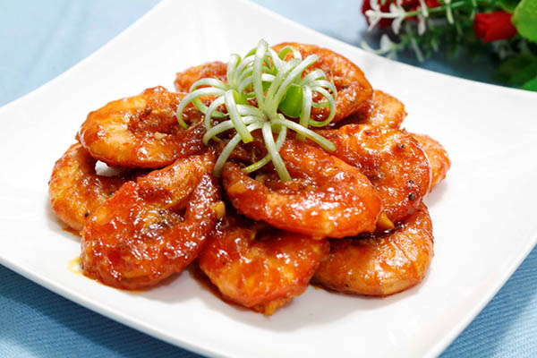

<h2><strong>[ Hướng dẫn nấu ăn]</strong></h2>

Chào các bạn, hôm nay mình sẽ khai vị cho cuối tuần bằng món TÔM RIM MẮM TỎI nha. Món này chế biến đơn giản lắm, đảm bảo những ai không đảm đang cũng cân được tuốt. Nào bây giờ mình bắt tay vào làm thôi.

🛒 Nguyên liệu:

<ul>
  <li>Tôm tươi</li>
  <li>Tỏi, ớt</li>
  <li>Dầu ăn</li>
  <li>Gia vị: hạt nêm, đường, muối, nước mắm</li>
</ul>

💦 Sơ chế:

- Sơ chế nguyên liệu tươi: Làm sạch tôm tươi bằng cách cắt bỏ râu và đuôi tôm, xóc qua với muối rồi rửa sạch.
- Rửa sạch tỏi và ớt, băm nhỏ rồi cho vào chén

👩‍🍳 Chế biến món ăn:

- Ướp gia vị:
  - Uớp hạt nêm, đường trắng, một ít muối, trộn đều cho tôm ngấm gia vị.
  - Ở bước rim tôm mình sẽ rim bằng nước mắm nên chú ý cân đối gia vị để không bị mặn quá nhé cả nhà
- Rim tôm:
  - Cho dầu ăn vào chảo và phi thơm tỏi, ớt cho đến khi hơi vàng.
  - Sau đó cho tôm vào, đảo đều khoảng 1 phút cho tôm săn lại, cho 1 muỗng nước lọc và cho tiếp nước mắm vào vừa đủ
    > **cẩn thận kẻo mặn quá là nghỉ ăn luôn nhé 😂.**

Rim tôm với lửa nhỏ để tôm thấm gia vị, đến khi chảo gần cạn thì tắt bếp, lúc này nhớ thường xuyên chú ý chảo nha các bạn, chảo mà khét là má cho ăn đòn thay ăn cơm á :))

Tắt bếp, cho ra dĩa và trang trí vài cọng hành ngò cho đời thêm xanh

Món này mà ăn với cơm trắng là tốn cơm lắm luôn, tôm mềm mềm, vị mặn vừa phải cùng mùi tỏi thơm nức mũi nữa, chắc chắn sẽ là bữa ăn ngon miệng đầy dinh dưỡng cho cuối tuần đó, hơn nữa chế biến món này cũng khá nhanh, các bạn tiết kiệm được mớ thời gian để đi chơi với bồ rồi nhá 😘

[#camnangcooking]() [#rimtom]() [#vietnamesefood]()
