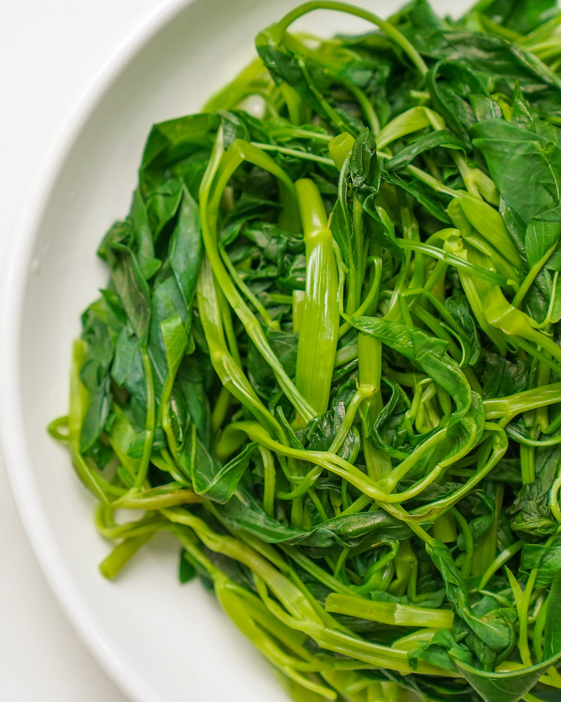

<h2><strong>[ Hướng dẫn nấu ăn ]</strong></h2>

HƯỚNG DẪN LUỘC RAU NGON NHẤT

Ắt hẳn ai trong chúng ta cũng đã từng luộc rau ít nhất 1 lần, tuy là món ăn đơn giản nhưng không phải ai cũng biết cách làm ngon nhất đâu nha, hôm nay hãy cùng với Poro tìm hiểu cách luộc thật ngon mà vẫn giữ được màu và độ giòn của rau, để xem trước nay các bạn đã luộc rau đúng nhất chưa nhé 😉

Bài này chỉ nói tổng quan, sẽ có các bài về từng loại rau riêng biệt

**Tiền xử lý**:

- Sau khi mua về cần lặt lá hư và rửa sạch, sau đó ngâm trong thau nước muối từ 5-7 phút
- Không nên ngâm quá lâu vì khiến rau dễ bị dập và hút ngược lại những chất bẩn đó

**Bắt đầu**:

- Chuẩn bị một nồi nước đủ để rau ngập nước khi luộc, không nên cho nước quá ít vì sẽ khiến rau không chín đều và mất nhiều thời gian luộc.

- Cho 1 muỗng muối vào nồi nước, đun cho nước thật sôi rồi cho rau vào, chỉnh lửa lớn khi luộc.
- Nếu chỉnh lửa quá nhỏ, nước lâu sôi, rau chín không đều, thời gian luộc kéo dài làm giảm lượng vitamin trong rau và khiến rau bị mất màu.
  > Ngoài muối ăn thì giấm và chanh cũng có tác dụng giữ màu của rau khi luộc đấy nhé.
- Đảo đều để rau chín hoàn toàn, tùy loại rau mà thời gian luộc sẽ dao động từ 2-6 phút. Khi rau vừa chín tới thì các bạn có thể cho vào vài giọt dầu ăn để giúp rau bóng đẹp hơn nhé.
- Sau khi luộc xong, cho rau vào chậu nước đá ngay để giữ màu xanh tươi và độ giòn của rau.

Với các bước luộc rau như trên, các bạn sẽ có ngay đĩa rau luộc xanh mơn mởn và giòn ngon trong bữa ăn của mình rồi nhé.

**_Tóm lại_**:

- Không nên cho nước luộc rau quá ít
- Chỉnh lửa lớn khi luộc
- Cho muối vào giúp rau giữ màu tốt hơn
- Nên mở nắp nồi khi luộc để giúp rau xanh hơn

[#huongdannauan]() [#luocrau]()

