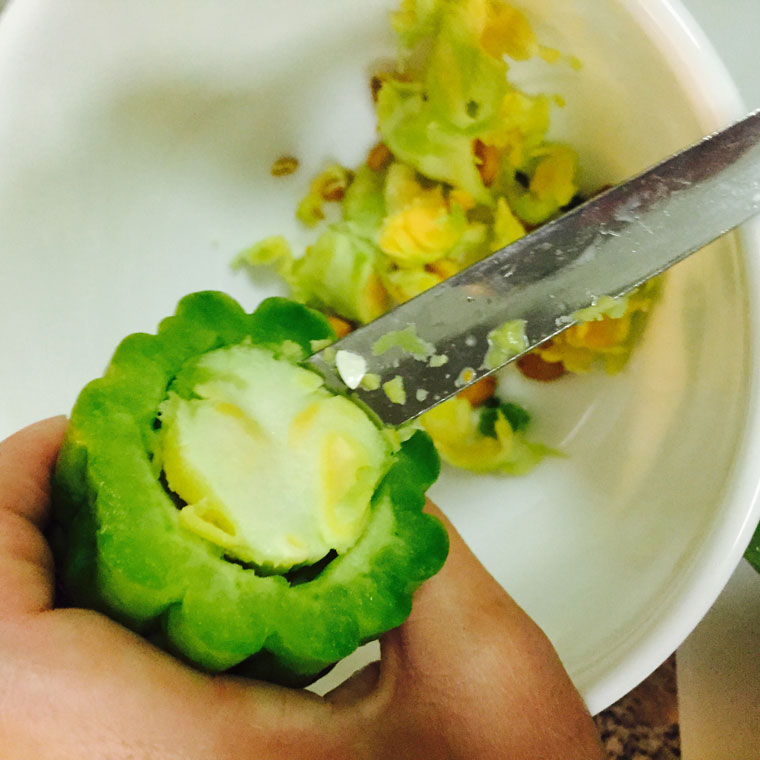
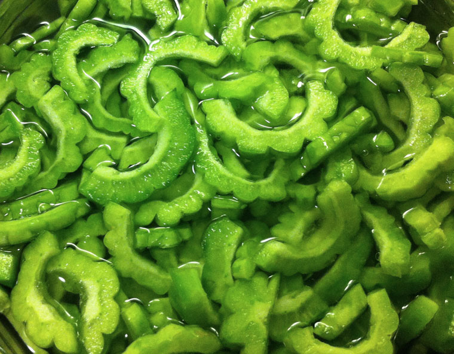
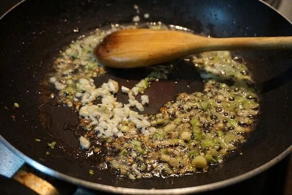
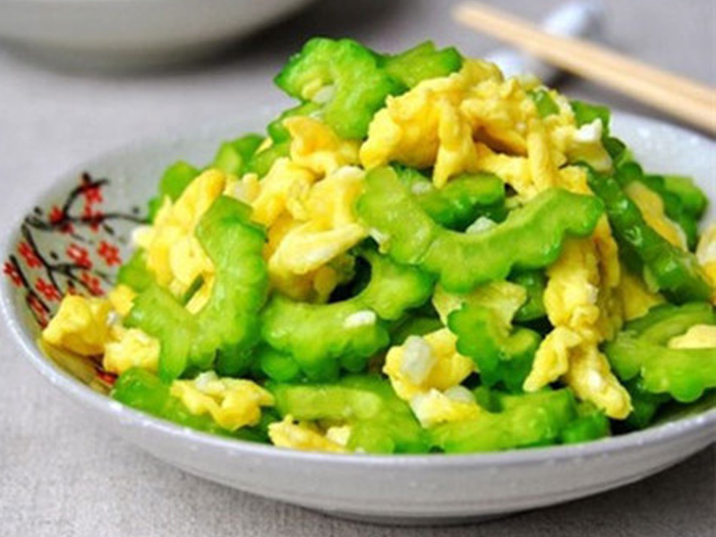

<h2><strong>[ Hướng dẫn nấu ăn ]</strong></h2>

**KHỔ QUA XÀO TRỨNG**

Chào các bạn, thuở còn nhỏ hẳn ai cũng từng được mẹ nấu cho ăn món này, đây là món ăn đơn giản nhưng lại chứa rất nhiều dinh dưỡng và cũng khá là bắt cơm nữa. Tuy nhiên đối với các em nhỏ không quen ăn đắng thì lại khá là sợ đúng không nào, xưa kia Poro cũng sợ ơi là sợ món này luôn đó, chỉ ăn được trứng thôi, nhưng dần lớn lên thì "ngại" thành "nghiện" lúc nào không hay 😜

Vị đắng của khổ qua có thể giảm qua cách lựa trái khổ qua đó, bây giờ hãy cùng mình đi chợ và chuẩn bị nguyên liệu cho món ăn này thôi.

> Cách chọn khổ qua nếu bạn không thích ăn đắng, đó là hãy lựa những trái khổ qua nở gai to nhé, có thể bạn sẽ chẳng cảm nhận được vị đắng nào luôn, hoặc chỉ là vị nhẵn một chút thôi 😋

**Nguyên liệu**:

- Khổ qua (mướp đắng): 2-3 trái cho 1-2 người ăn
- Trứng gà (hoặc trứng vịt): 2 quả
- Hành lá
- Tỏi (hoặc hành tím)
- Gia vị: hạt nêm, nước mắm, đường, tiêu xay

**Sơ chế**:

- Khổ qua rửa sạch, chẻ đôi,
- Dùng dao hoặc muỗng nạo bỏ phần cùi sát vào phần thịt xanh
  > vị đắng sẽ giảm đi đáng kể
- Xắt từng lát mỏng vừa ăn (không nên quá mỏng vì sẽ mất đi độ giòn sau khi xào)

  

  
    &nbsp;
  
  

  
    &nbsp;
     
</p

[#huongdannauan]() [#khoquaxaotrung]()
